# **Alibaba Cloud Ops MCP Server 架构分析报告**

## **🏗️ 项目概览**

Alibaba Cloud Ops MCP Server 是一个基于 [Model Context Protocol (MCP)](https://modelcontextprotocol.io/introduction) 的服务器，提供与阿里云API的无缝集成，使AI助手能够操作阿里云上的资源。该项目支持ECS、云监控、OOS、OSS、RDS、VPC等广泛使用的云产品。

## **📋 技术栈**

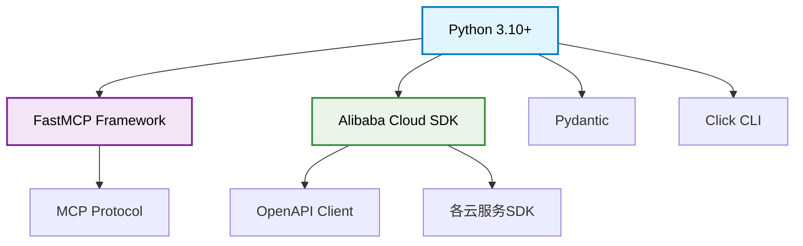
```mermaid
graph TB
    A["Python 3.10+"] --> B["FastMCP Framework"]
    A --> C["Alibaba Cloud SDK"]
    A --> D["Pydantic"]
    A --> E["Click CLI"]
    
    B --> F["MCP Protocol"]
    C --> G["OpenAPI Client"]
    C --> H["各云服务SDK"]
    
    style A fill:#e1f5fe,stroke:#0277bd,stroke-width:2px,color:#000
    style B fill:#f3e5f5,stroke:#7b1fa2,stroke-width:2px,color:#000
    style C fill:#e8f5e8,stroke:#388e3c,stroke-width:2px,color:#000
```

## **🏛️ 系统架构**

### **整体架构图**

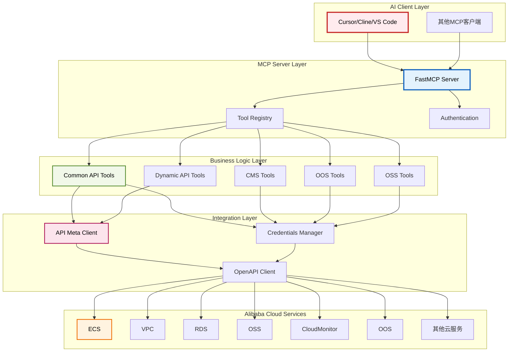
```mermaid
graph TD
    subgraph "AI Client Layer"
        A["Cursor/Cline/VS Code"]
        B["其他MCP客户端"]
    end
    
    subgraph "MCP Server Layer"
        C["FastMCP Server"]
        D["Tool Registry"]
        E["Authentication"]
    end
    
    subgraph "Business Logic Layer"
        F["Common API Tools"]
        G["CMS Tools"]
        H["OOS Tools"]
        I["OSS Tools"]
        J["Dynamic API Tools"]
    end
    
    subgraph "Integration Layer"
        K["API Meta Client"]
        L["Credentials Manager"]
        M["OpenAPI Client"]
    end
    
    subgraph "Alibaba Cloud Services"
        N["ECS"]
        O["VPC"]
        P["RDS"]
        Q["OSS"]
        R["CloudMonitor"]
        S["OOS"]
        T["其他云服务"]
    end
    
    A --> C
    B --> C
    C --> D
    C --> E
    D --> F
    D --> G
    D --> H
    D --> I
    D --> J
    F --> K
    F --> L
    G --> L
    H --> L
    I --> L
    J --> K
    K --> M
    L --> M
    M --> N
    M --> O
    M --> P
    M --> Q
    M --> R
    M --> S
    M --> T
    
    style A fill:#ffebee,stroke:#c62828,stroke-width:3px,color:#000
    style C fill:#e3f2fd,stroke:#1565c0,stroke-width:3px,color:#000
    style F fill:#f1f8e9,stroke:#558b2f,stroke-width:2px,color:#000
    style K fill:#fce4ec,stroke:#ad1457,stroke-width:2px,color:#000
    style N fill:#fff3e0,stroke:#ef6c00,stroke-width:2px,color:#000
```

### **核心模块结构**

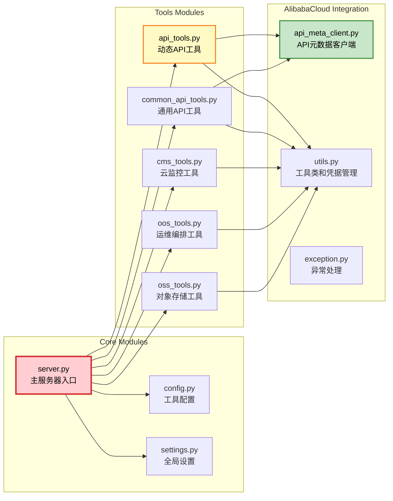
```mermaid
graph LR
    subgraph "Core Modules"
        A["server.py<br/>主服务器入口"]
        B["config.py<br/>工具配置"]
        C["settings.py<br/>全局设置"]
    end
    
    subgraph "AlibabaCloud Integration"
        D["api_meta_client.py<br/>API元数据客户端"]
        E["utils.py<br/>工具类和凭据管理"]
        F["exception.py<br/>异常处理"]
    end
    
    subgraph "Tools Modules"
        G["api_tools.py<br/>动态API工具"]
        H["common_api_tools.py<br/>通用API工具"]
        I["cms_tools.py<br/>云监控工具"]
        J["oos_tools.py<br/>运维编排工具"]
        K["oss_tools.py<br/>对象存储工具"]
    end
    
    A --> B
    A --> C
    A --> G
    A --> H
    A --> I
    A --> J
    A --> K
    G --> D
    G --> E
    H --> D
    H --> E
    I --> E
    J --> E
    K --> E
    
    style A fill:#ffcdd2,stroke:#d32f2f,stroke-width:3px,color:#000
    style D fill:#c8e6c9,stroke:#388e3c,stroke-width:2px,color:#000
    style G fill:#fff9c4,stroke:#f57f17,stroke-width:2px,color:#000
```

## **🔄 数据流和交互时序**

### **API调用时序图**

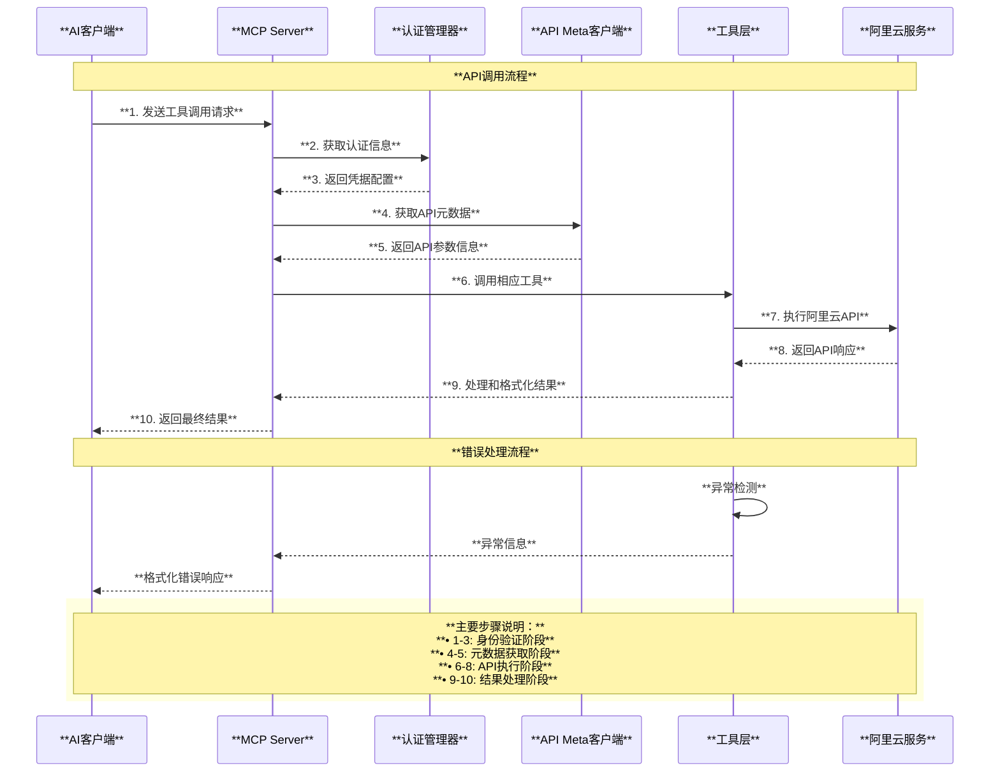
```mermaid
sequenceDiagram
    participant Client as **AI客户端**
    participant Server as **MCP Server**
    participant Auth as **认证管理器**
    participant Meta as **API Meta客户端**
    participant Tools as **工具层**
    participant Cloud as **阿里云服务**
    
    Note over Client,Cloud: **API调用流程**
    Client->>Server: **1. 发送工具调用请求**
    Server->>Auth: **2. 获取认证信息**
    Auth-->>Server: **3. 返回凭据配置**
    Server->>Meta: **4. 获取API元数据**
    Meta-->>Server: **5. 返回API参数信息**
    Server->>Tools: **6. 调用相应工具**
    Tools->>Cloud: **7. 执行阿里云API**
    Cloud-->>Tools: **8. 返回API响应**
    Tools-->>Server: **9. 处理和格式化结果**
    Server-->>Client: **10. 返回最终结果**
    
    Note over Client,Cloud: **错误处理流程**
    Tools->>Tools: **异常检测**
    Tools-->>Server: **异常信息**
    Server-->>Client: **格式化错误响应**
    
    rect rgb(255, 255, 224)
        Note over Client,Cloud: **主要步骤说明：**<br/>**• 1-3: 身份验证阶段**<br/>**• 4-5: 元数据获取阶段**<br/>**• 6-8: API执行阶段**<br/>**• 9-10: 结果处理阶段**
    end
```

### **OOS执行时序图**

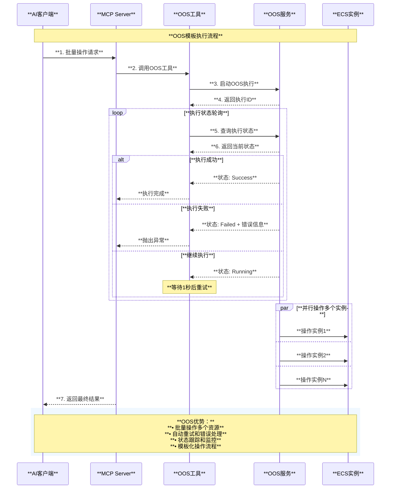
```mermaid
sequenceDiagram
    participant Client as **AI客户端**
    participant Server as **MCP Server**
    participant OOS as **OOS工具**
    participant Cloud as **OOS服务**
    participant ECS as **ECS实例**
    
    Note over Client,ECS: **OOS模板执行流程**
    Client->>Server: **1. 批量操作请求**
    Server->>OOS: **2. 调用OOS工具**
    OOS->>Cloud: **3. 启动OOS执行**
    Cloud-->>OOS: **4. 返回执行ID**
    
    loop **执行状态轮询**
        OOS->>Cloud: **5. 查询执行状态**
        Cloud-->>OOS: **6. 返回当前状态**
        alt **执行成功**
            Cloud-->>OOS: **状态: Success**
            OOS-->>Server: **执行完成**
        else **执行失败**
            Cloud-->>OOS: **状态: Failed + 错误信息**
            OOS-->>Server: **抛出异常**
        else **继续执行**
            Cloud-->>OOS: **状态: Running**
            Note over OOS: **等待1秒后重试**
        end
    end
    
    par **并行操作多个实例**
        Cloud->>ECS: **操作实例1**
        and
        Cloud->>ECS: **操作实例2**
        and
        Cloud->>ECS: **操作实例N**
    end
    
    Server-->>Client: **7. 返回最终结果**
    
    rect rgb(240, 248, 255)
        Note over Client,ECS: **OOS优势：**<br/>**• 批量操作多个资源**<br/>**• 自动重试和错误处理**<br/>**• 状态跟踪和监控**<br/>**• 模板化操作流程**
    end
```

## **🔧 模块功能详解**

### **核心服务器模块 (`server.py`)**

```python
# 主要功能特性
- FastMCP服务器初始化和配置
- 工具注册和管理
- 多种传输协议支持 (stdio, sse, streamable-http)
- 服务过滤和环境配置
- CLI参数处理
```

**关键配置选项：**

| **参数** | **类型** | **默认值** | **说明** |
|---------|---------|------------|----------|
| `--transport` | string | `stdio` | **传输协议类型** |
| `--port` | int | `8000` | **服务端口** |
| `--host` | string | `127.0.0.1` | **服务主机** |
| `--services` | string | `None` | **支持的服务列表** |
| `--env` | string | `domestic` | **环境类型（国内/国际）** |

### **动态API工具生成器 (`api_tools.py`)**

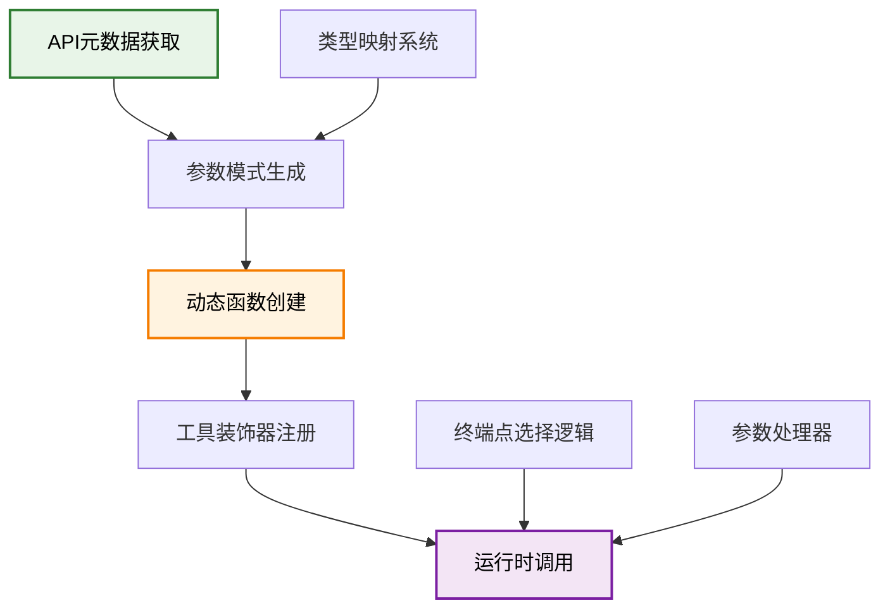
```mermaid
graph TD
    A["API元数据获取"] --> B["参数模式生成"]
    B --> C["动态函数创建"]
    C --> D["工具装饰器注册"]
    D --> E["运行时调用"]
    
    F["类型映射系统"] --> B
    G["终端点选择逻辑"] --> E
    H["参数处理器"] --> E
    
    style A fill:#e8f5e8,stroke:#2e7d32,stroke-width:2px,color:#000
    style C fill:#fff3e0,stroke:#f57c00,stroke-width:2px,color:#000
    style E fill:#f3e5f5,stroke:#7b1fa2,stroke-width:2px,color:#000
```

**核心特性：**
- **动态类型映射**: 将API元数据转换为Python类型
- **参数验证**: 自动生成参数验证逻辑
- **终端点智能选择**: 根据服务和区域选择合适的API终端点
- **批量参数处理**: 特殊处理ECS等服务的JSON数组参数

### **认证和安全管理 (`utils.py`)**

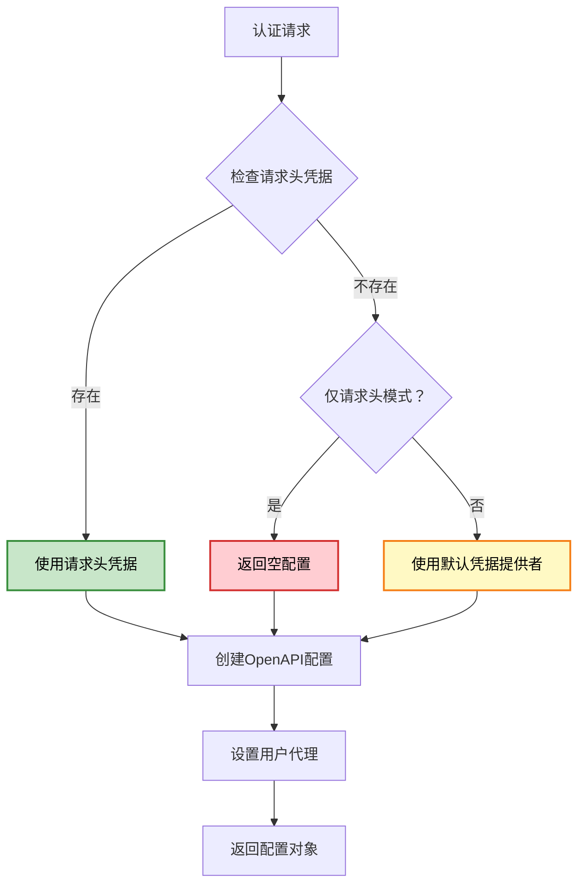
```mermaid
graph TD
    A["认证请求"] --> B{"检查请求头凭据"}
    B -->|存在| C["使用请求头凭据"]
    B -->|不存在| D{"仅请求头模式？"}
    D -->|是| E["返回空配置"]
    D -->|否| F["使用默认凭据提供者"]
    
    C --> G["创建OpenAPI配置"]
    E --> G
    F --> G
    G --> H["设置用户代理"]
    H --> I["返回配置对象"]
    
    style C fill:#c8e6c9,stroke:#388e3c,stroke-width:2px,color:#000
    style E fill:#ffcdd2,stroke:#d32f2f,stroke-width:2px,color:#000
    style F fill:#fff9c4,stroke:#f57f17,stroke-width:2px,color:#000
```

**安全特性：**
- **多层认证**: 支持请求头、环境变量、默认凭据链
- **凭据隔离**: 不同请求使用独立凭据
- **安全传输**: 统一使用HTTPS协议
- **用户代理标识**: 标识请求来源

## **🔐 安全设计分析**

### **认证机制**

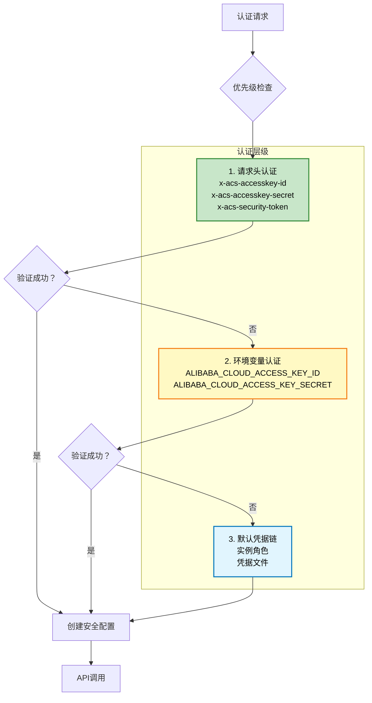
```mermaid
graph TD
    subgraph "认证层级"
        A["1. 请求头认证<br/>x-acs-accesskey-id<br/>x-acs-accesskey-secret<br/>x-acs-security-token"]
        B["2. 环境变量认证<br/>ALIBABA_CLOUD_ACCESS_KEY_ID<br/>ALIBABA_CLOUD_ACCESS_KEY_SECRET"]
        C["3. 默认凭据链<br/>实例角色<br/>凭据文件"]
    end
    
    D["认证请求"] --> E{"优先级检查"}
    E --> A
    A --> F{"验证成功？"}
    F -->|是| G["创建安全配置"]
    F -->|否| B
    B --> H{"验证成功？"}
    H -->|是| G
    H -->|否| C
    C --> G
    
    G --> I["API调用"]
    
    style A fill:#c8e6c9,stroke:#388e3c,stroke-width:2px,color:#000
    style B fill:#fff9c4,stroke:#f57f17,stroke-width:2px,color:#000
    style C fill:#e1f5fe,stroke:#0277bd,stroke-width:2px,color:#000
```

### **安全控制措施**

| **安全层面** | **实现机制** | **防护效果** |
|-------------|-------------|-------------|
| **传输安全** | HTTPS协议 | **数据传输加密** |
| **身份验证** | 多重认证机制 | **确保调用者身份** |
| **权限控制** | 阿里云RAM | **细粒度权限管理** |
| **参数验证** | Pydantic模型 | **输入数据验证** |
| **异常处理** | 统一异常体系 | **错误信息脱敏** |
| **审计日志** | 结构化日志 | **操作可追溯性** |

## **⚡ 性能设计**

### **优化策略**

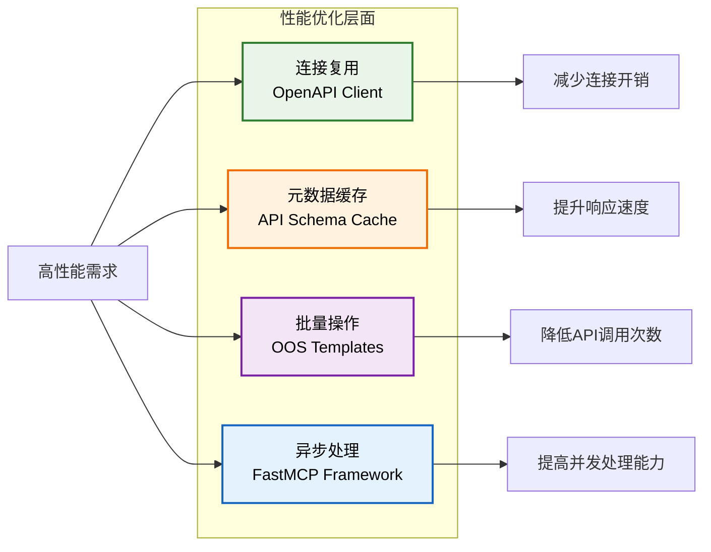
```mermaid
graph LR
    subgraph "性能优化层面"
        A["连接复用<br/>OpenAPI Client"]
        B["元数据缓存<br/>API Schema Cache"]
        C["批量操作<br/>OOS Templates"]
        D["异步处理<br/>FastMCP Framework"]
    end
    
    E["高性能需求"] --> A
    E --> B
    E --> C
    E --> D
    
    A --> F["减少连接开销"]
    B --> G["提升响应速度"]
    C --> H["降低API调用次数"]
    D --> I["提高并发处理能力"]
    
    style A fill:#e8f5e8,stroke:#2e7d32,stroke-width:2px,color:#000
    style B fill:#fff3e0,stroke:#ef6c00,stroke-width:2px,color:#000
    style C fill:#f3e5f5,stroke:#7b1fa2,stroke-width:2px,color:#000
    style D fill:#e3f2fd,stroke:#1565c0,stroke-width:2px,color:#000
```

## **🛠️ 支持的云服务工具**

### **服务覆盖矩阵**

| **云服务** | **工具数量** | **实现方式** | **主要功能** |
|-----------|-------------|-------------|-------------|
| **ECS** | **15+** | **OOS + API** | **实例管理、命令执行、生命周期管理** |
| **VPC** | **2** | **API** | **网络查询、配置管理** |
| **RDS** | **4** | **OOS + API** | **数据库实例管理、状态控制** |
| **OSS** | **4** | **API** | **存储桶管理、对象操作** |
| **CMS** | **9** | **API** | **监控数据获取、性能指标查询** |
| **OOS** | **模板执行器** | **OOS** | **批量运维操作、工作流编排** |

### **功能分类统计**

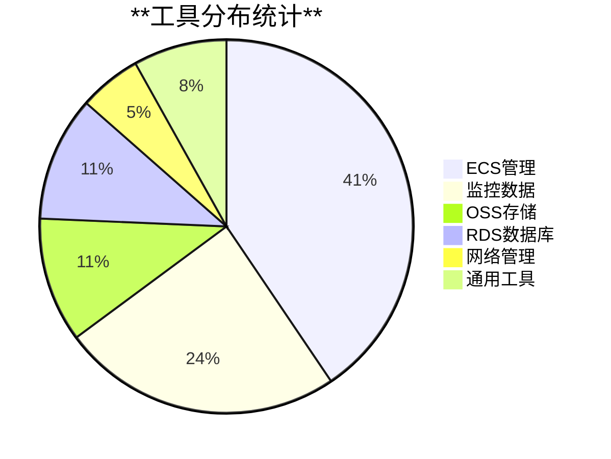
```mermaid
pie title **工具分布统计**
    "ECS管理" : 15
    "监控数据" : 9
    "OSS存储" : 4
    "RDS数据库" : 4
    "网络管理" : 2
    "通用工具" : 3
```

## **🔄 扩展性设计**

### **插件化架构**

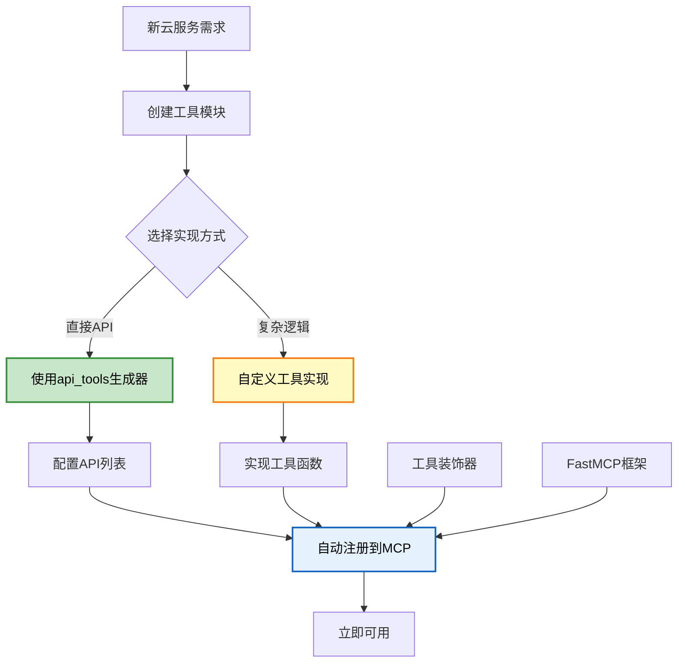
```mermaid
graph TD
    A["新云服务需求"] --> B["创建工具模块"]
    B --> C{"选择实现方式"}
    C -->|直接API| D["使用api_tools生成器"]
    C -->|复杂逻辑| E["自定义工具实现"]
    
    D --> F["配置API列表"]
    E --> G["实现工具函数"]
    
    F --> H["自动注册到MCP"]
    G --> H
    H --> I["立即可用"]
    
    J["工具装饰器"] --> H
    K["FastMCP框架"] --> H
    
    style D fill:#c8e6c9,stroke:#388e3c,stroke-width:2px,color:#000
    style E fill:#fff9c4,stroke:#f57f17,stroke-width:2px,color:#000
    style H fill:#e3f2fd,stroke:#1565c0,stroke-width:2px,color:#000
```

### **配置驱动的服务支持**

```python
# 添加新服务的步骤：

# 1. 更新支持服务映射
SUPPORTED_SERVICES_MAP = {
    "ecs": "Elastic Compute Service (ECS)",
    "新服务": "新服务描述",
    # ...
}

# 2. 配置API列表（可选）
config = {
    '新服务': [
        'API1',
        'API2',
        # ...
    ]
}

# 3. 自动生成工具（无需额外代码）
```

## **📈 未来发展方向**

### **技术演进路线**

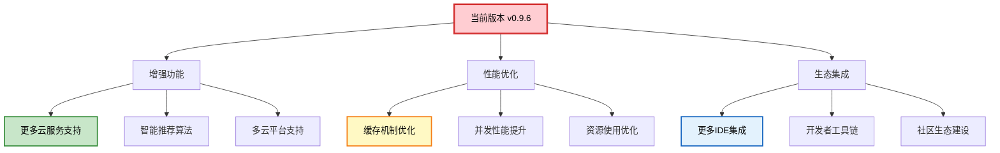
```mermaid
graph TD
    A["当前版本 v0.9.6"] --> B["增强功能"]
    A --> C["性能优化"]
    A --> D["生态集成"]
    
    B --> E["更多云服务支持"]
    B --> F["智能推荐算法"]
    B --> G["多云平台支持"]
    
    C --> H["缓存机制优化"]
    C --> I["并发性能提升"]
    C --> J["资源使用优化"]
    
    D --> K["更多IDE集成"]
    D --> L["开发者工具链"]
    D --> M["社区生态建设"]
    
    style A fill:#ffcdd2,stroke:#d32f2f,stroke-width:3px,color:#000
    style E fill:#c8e6c9,stroke:#388e3c,stroke-width:2px,color:#000
    style H fill:#fff9c4,stroke:#f57f17,stroke-width:2px,color:#000
    style K fill:#e3f2fd,stroke:#1565c0,stroke-width:2px,color:#000
```

## **💻 代码功能架构深入分析**

### **工具注册与管理机制**

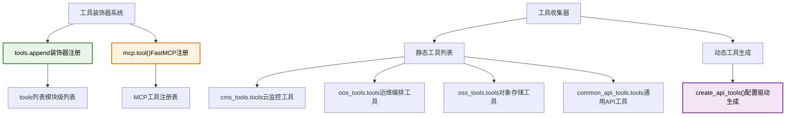
```mermaid
graph TD
    A["工具装饰器系统"] --> B["tools.append装饰器注册"]
    A --> C["mcp.tool()FastMCP注册"]
    
    D["工具收集器"] --> E["静态工具列表"]
    D --> F["动态工具生成"]
    
    B --> G["tools列表模块级列表"]
    C --> H["MCP工具注册表"]
    
    E --> I["cms_tools.tools云监控工具"]
    E --> J["oos_tools.tools运维编排工具"]
    E --> K["oss_tools.tools对象存储工具"]
    E --> L["common_api_tools.tools通用API工具"]
    
    F --> M["create_api_tools()配置驱动生成"]
    
    style B fill:#e8f5e8,stroke:#2e7d32,stroke-width:2px,color:#000
    style C fill:#fff3e0,stroke:#ef6c00,stroke-width:2px,color:#000
    style M fill:#f3e5f5,stroke:#7b1fa2,stroke-width:2px,color:#000
```

**工具注册代码模式：**
```python
# 静态工具注册模式
tools = []  # 模块级工具收集器

@tools.append  # 装饰器自动添加到列表
def ToolFunction(param1: str = Field(...)):
    """工具功能描述"""
    return implementation_logic()

# 服务器启动时批量注册
for tool in module_tools.tools:
    mcp.tool(tool)  # FastMCP框架注册
```

### **动态代码生成引擎**

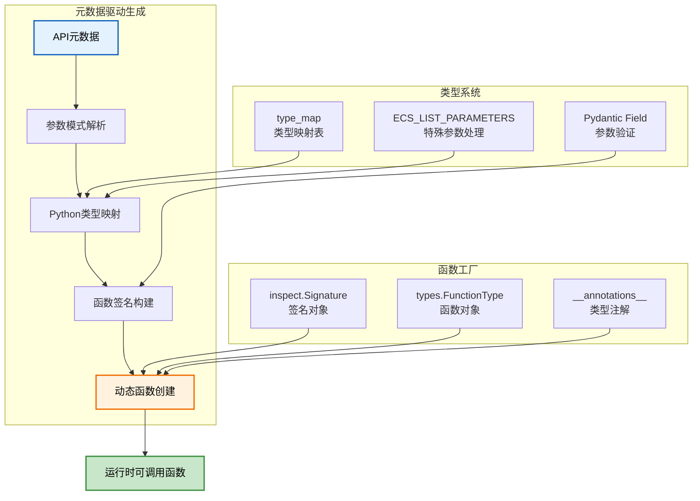
```mermaid
graph TD
    subgraph "元数据驱动生成"
        A["API元数据"] --> B["参数模式解析"]
        B --> C["Python类型映射"]
        C --> D["函数签名构建"]
        D --> E["动态函数创建"]
    end
    
    subgraph "类型系统"
        F["type_map<br/>类型映射表"] --> C
        G["ECS_LIST_PARAMETERS<br/>特殊参数处理"] --> C
        H["Pydantic Field<br/>参数验证"] --> D
    end
    
    subgraph "函数工厂"
        I["inspect.Signature<br/>签名对象"] --> E
        J["types.FunctionType<br/>函数对象"] --> E
        K["__annotations__<br/>类型注解"] --> E
    end
    
    E --> L["运行时可调用函数"]
    
    style A fill:#e3f2fd,stroke:#1565c0,stroke-width:2px,color:#000
    style E fill:#fff3e0,stroke:#ef6c00,stroke-width:2px,color:#000
    style L fill:#c8e6c9,stroke:#388e3c,stroke-width:2px,color:#000
```

**核心代码生成流程：**
```python
def _create_tool_function_with_signature(service: str, api: str, fields: dict, description: str):
    # 1. 构建参数列表和类型注解
    parameters = []
    annotations = {}
    
    for name, (type_, field_info) in fields.items():
        field_default = Field(default=default_value, description=field_description)
        parameters.append(inspect.Parameter(
            name=name,
            kind=inspect.Parameter.POSITIONAL_OR_KEYWORD,
            default=field_default,
            annotation=type_
        ))
        annotations[name] = type_
    
    # 2. 创建函数签名
    signature = inspect.Signature(parameters)
    
    # 3. 定义函数执行逻辑
    def func_code(*args, **kwargs):
        bound_args = signature.bind(*args, **kwargs)
        bound_args.apply_defaults()
        return _tools_api_call(service, api, bound_args.arguments, None)
    
    # 4. 创建真正的函数对象
    func = types.FunctionType(
        func_code.__code__,
        globals(),
        function_name,
        None,
        func_code.__closure__
    )
    
    # 5. 设置函数元数据
    func.__signature__ = signature
    func.__annotations__ = annotations
    func.__doc__ = description
    
    return func
```

### **异常处理体系架构**

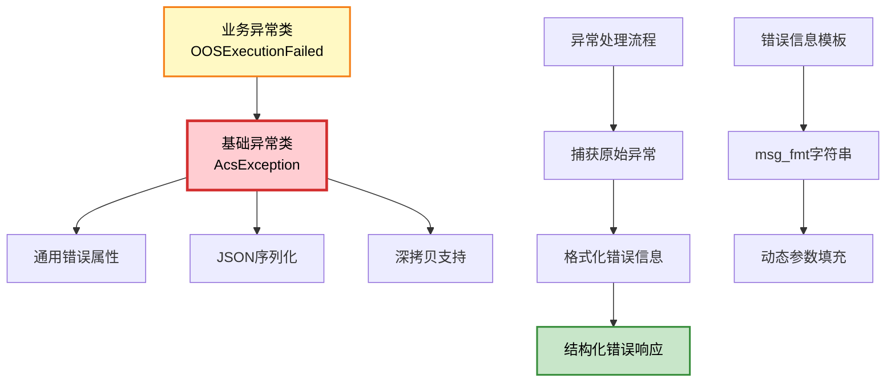
```mermaid
graph TD
    A["基础异常类<br/>AcsException"] --> B["通用错误属性"]
    A --> C["JSON序列化"]
    A --> D["深拷贝支持"]
    
    E["业务异常类<br/>OOSExecutionFailed"] --> A
    
    F["异常处理流程"] --> G["捕获原始异常"]
    G --> H["格式化错误信息"]
    H --> I["结构化错误响应"]
    
    J["错误信息模板"] --> K["msg_fmt字符串"]
    K --> L["动态参数填充"]
    
    style A fill:#ffcdd2,stroke:#d32f2f,stroke-width:3px,color:#000
    style E fill:#fff9c4,stroke:#f57f17,stroke-width:2px,color:#000
    style I fill:#c8e6c9,stroke:#388e3c,stroke-width:2px,color:#000
```

**异常类继承设计：**
```python
class AcsException(Exception):
    msg_fmt = 'An unknown exception occurred.'
    status = 500
    code = 'InternalError'
    
    def __init__(self, **kwargs):
        # 动态消息格式化
        self.message = self.msg_fmt.format(**kwargs) if kwargs else self.msg_fmt
    
    def __str__(self):
        # 结构化JSON输出
        return json.dumps({
            'Message': self.message,
            'Code': self.code
        })

# 具体业务异常
class OOSExecutionFailed(AcsException):
    msg_fmt = 'OOS Execution Failed, reason: {reason}.'
    status = 400
    code = 'Execution.Failed'
```

### **配置管理架构**

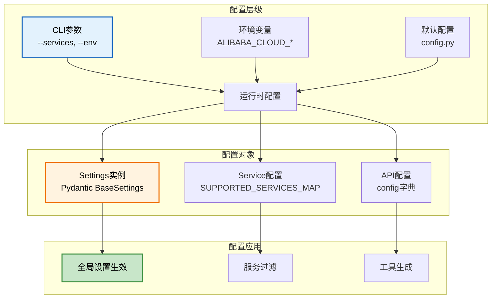
```mermaid
graph TD
    subgraph "配置层级"
        A["CLI参数<br/>--services, --env"] --> B["运行时配置"]
        C["环境变量<br/>ALIBABA_CLOUD_*"] --> B
        D["默认配置<br/>config.py"] --> B
    end
    
    subgraph "配置对象"
        B --> E["Settings实例<br/>Pydantic BaseSettings"]
        B --> F["Service配置<br/>SUPPORTED_SERVICES_MAP"]
        B --> G["API配置<br/>config字典"]
    end
    
    subgraph "配置应用"
        E --> H["全局设置生效"]
        F --> I["服务过滤"]
        G --> J["工具生成"]
    end
    
    style A fill:#e3f2fd,stroke:#1565c0,stroke-width:2px,color:#000
    style E fill:#fff3e0,stroke:#ef6c00,stroke-width:2px,color:#000
    style H fill:#c8e6c9,stroke:#388e3c,stroke-width:2px,color:#000
```

**配置管理代码实现：**
```python
# 1. Pydantic配置类
class Settings(BaseSettings):
    headers_credential_only: bool = False
    env: str = "domestic"

settings = Settings()  # 全局单例

# 2. 服务映射配置
SUPPORTED_SERVICES_MAP = {
    "ecs": "Elastic Compute Service (ECS)",
    "vpc": "Virtual Private Cloud (VPC)",
    # ...
}

# 3. API工具配置
config = {
    'ecs': ['DescribeInstances', 'DescribeRegions', ...],
    'vpc': ['DescribeVpcs', 'DescribeVSwitches'],
    # ...
}

# 4. 配置应用逻辑
if services:
    service_keys = [s.strip().lower() for s in services.split(",")]
    service_list = [(key, SUPPORTED_SERVICES_MAP.get(key, key)) for key in service_keys]
    set_custom_service_list(service_list)
```

### **API元数据管理系统**

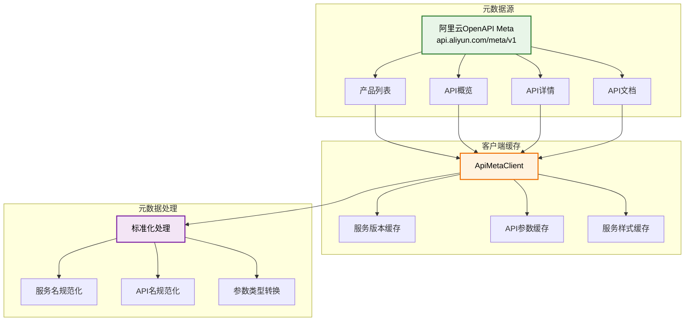
```mermaid
graph TD
    subgraph "元数据源"
        A["阿里云OpenAPI Meta<br/>api.aliyun.com/meta/v1"] --> B["产品列表"]
        A --> C["API概览"]
        A --> D["API详情"]
        A --> E["API文档"]
    end
    
    subgraph "客户端缓存"
        F["ApiMetaClient"] --> G["服务版本缓存"]
        F --> H["API参数缓存"]
        F --> I["服务样式缓存"]
    end
    
    subgraph "元数据处理"
        J["标准化处理"] --> K["服务名规范化"]
        J --> L["API名规范化"]
        J --> M["参数类型转换"]
    end
    
    B --> F
    C --> F
    D --> F
    E --> F
    F --> J
    
    style A fill:#e8f5e8,stroke:#2e7d32,stroke-width:2px,color:#000
    style F fill:#fff3e0,stroke:#ef6c00,stroke-width:2px,color:#000
    style J fill:#f3e5f5,stroke:#7b1fa2,stroke-width:2px,color:#000
```

**元数据客户端核心方法：**
```python
class ApiMetaClient:
    BASE_URL = 'https://api.aliyun.com/meta/v1'
    
    @classmethod
    def get_api_meta(cls, service, api):
        """获取API完整元数据"""
        version = cls.get_service_version(service)
        service_standard, api_standard = cls.get_standard_service_and_api(service, api, version)
        # 验证服务和API有效性
        if service_standard is None:
            raise Exception(f'InvalidServiceName: Please check the Service ({service}) you provide.')
        if api_standard is None:
            raise Exception(f'InvalidAPIName: Please check the Service ({service}) and the API ({api}) you provide.')
        
        data = cls.get_response_from_pop_api(cls.GET_API_INFO, service_standard, api_standard, version)
        return data, version
    
    @classmethod
    def get_api_parameters(cls, service, api, params_in=''):
        """递归解析API参数，处理引用关系"""
        # 处理复杂的参数结构和引用
        # 避免循环引用
        visited_refs = set()
        # ... 复杂的递归解析逻辑
```

### **智能提示理解系统**

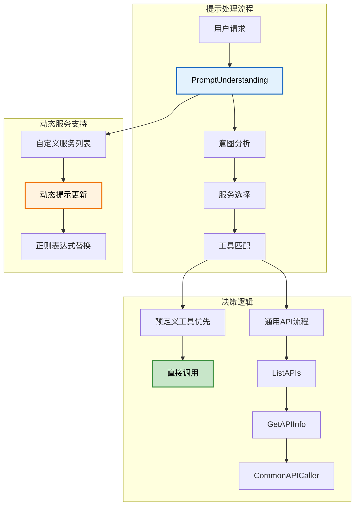
```mermaid
graph TD
    subgraph "提示处理流程"
        A["用户请求"] --> B["PromptUnderstanding"]
        B --> C["意图分析"]
        C --> D["服务选择"]
        D --> E["工具匹配"]
    end
    
    subgraph "决策逻辑"
        F["预定义工具优先"] --> G["直接调用"]
        H["通用API流程"] --> I["ListAPIs"]
        I --> J["GetAPIInfo"]
        J --> K["CommonAPICaller"]
    end
    
    subgraph "动态服务支持"
        L["自定义服务列表"] --> M["动态提示更新"]
        M --> N["正则表达式替换"]
    end
    
    E --> F
    E --> H
    B --> L
    
    style B fill:#e3f2fd,stroke:#1565c0,stroke-width:2px,color:#000
    style G fill:#c8e6c9,stroke:#388e3c,stroke-width:2px,color:#000
    style M fill:#fff3e0,stroke:#ef6c00,stroke-width:2px,color:#000
```

**智能提示实现：**
```python
@tools.append
def PromptUnderstanding() -> str:
    """Always use this tool first to understand the user's query"""
    global _CUSTOM_SERVICE_LIST
    
    content = PROMPT_UNDERSTANDING  # 基础提示模板
    
    # 动态更新支持的服务列表
    if _CUSTOM_SERVICE_LIST:
        import re
        pattern = r'Supported Services\s*:\s*\n(?:\s{3}- .+?\n)+'
        replacement = f"Supported Services:\n   - " + "\n   - ".join([f"{k}: {v}" for k, v in _CUSTOM_SERVICE_LIST])
        content = re.sub(pattern, replacement, content, flags=re.DOTALL)
    
    return content
```

### **终端点路由系统**

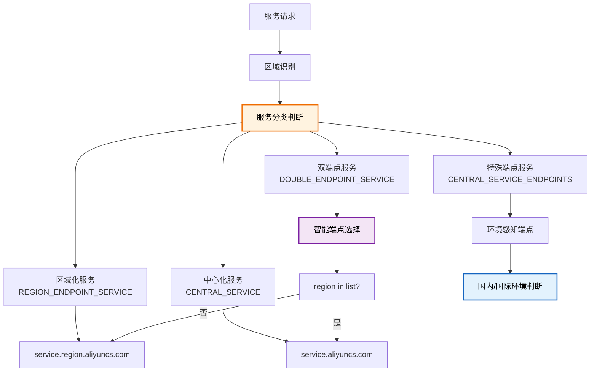
```mermaid
graph TD
    A["服务请求"] --> B["区域识别"]
    B --> C["服务分类判断"]
    
    C --> D["区域化服务<br/>REGION_ENDPOINT_SERVICE"]
    C --> E["双端点服务<br/>DOUBLE_ENDPOINT_SERVICE"]
    C --> F["中心化服务<br/>CENTRAL_SERVICE"]
    C --> G["特殊端点服务<br/>CENTRAL_SERVICE_ENDPOINTS"]
    
    D --> H["service.region.aliyuncs.com"]
    E --> I["智能端点选择"]
    F --> J["service.aliyuncs.com"]
    G --> K["环境感知端点"]
    
    I --> L["region in list?"]
    L -->|是| J
    L -->|否| H
    
    K --> M["国内/国际环境判断"]
    
    style C fill:#fff3e0,stroke:#ef6c00,stroke-width:2px,color:#000
    style I fill:#f3e5f5,stroke:#7b1fa2,stroke-width:2px,color:#000
    style M fill:#e3f2fd,stroke:#1565c0,stroke-width:2px,color:#000
```

**端点选择算法：**
```python
def _get_service_endpoint(service: str, region_id: str):
    region_id = region_id.lower()
    
    # 1. 优先处理中心化服务端点
    central = CENTRAL_SERVICE_ENDPOINTS.get(service)
    if central:
        if settings.env == 'international':
            return central['InternationalEndpoint']
        elif region_id in central.get('DomesticRegion', []) or settings.env == 'domestic':
            return central['DomesticEndpoint']
        else:
            return central['InternationalEndpoint']
    
    # 2. 区域化端点服务
    if service in REGION_ENDPOINT_SERVICE:
        return f'{service}.{region_id}.aliyuncs.com'
    
    # 3. 双端点服务智能选择
    if service in DOUBLE_ENDPOINT_SERVICE:
        not_in_central = region_id not in DOUBLE_ENDPOINT_SERVICE[service]
        if not_in_central:
            return f'{service}.{region_id}.aliyuncs.com'
        else:
            return f'{service}.aliyuncs.com'
    
    # 4. 默认策略
    return f'{service}.{region_id}.aliyuncs.com'
```

### **认证凭据管理架构**

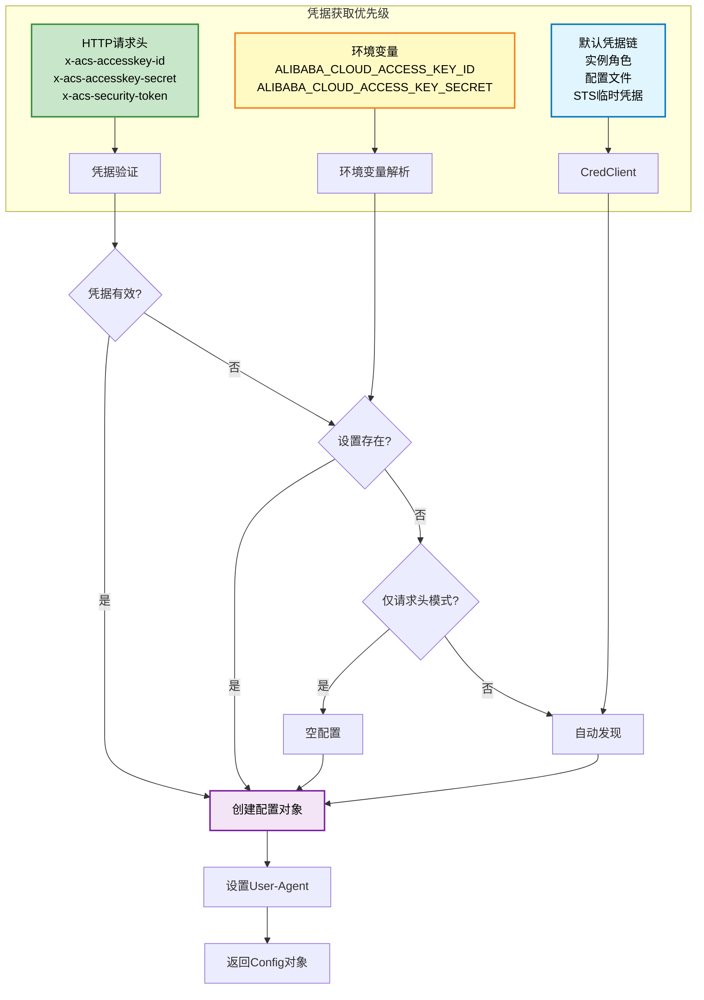
```mermaid
graph TD
    subgraph "凭据获取优先级"
        A["HTTP请求头<br/>x-acs-accesskey-id<br/>x-acs-accesskey-secret<br/>x-acs-security-token"] --> B["凭据验证"]
        
        C["环境变量<br/>ALIBABA_CLOUD_ACCESS_KEY_ID<br/>ALIBABA_CLOUD_ACCESS_KEY_SECRET"] --> D["环境变量解析"]
        
        E["默认凭据链<br/>实例角色<br/>配置文件<br/>STS临时凭据"] --> F["CredClient"]
    end
    
    B --> G{"凭据有效?"}
    D --> H{"设置存在?"}
    F --> I["自动发现"]
    
    G -->|是| J["创建配置对象"]
    G -->|否| H
    H -->|是| J
    H -->|否| K{"仅请求头模式?"}
    K -->|是| L["空配置"]
    K -->|否| I
    I --> J
    L --> J
    
    J --> M["设置User-Agent"]
    M --> N["返回Config对象"]
    
    style A fill:#c8e6c9,stroke:#388e3c,stroke-width:2px,color:#000
    style C fill:#fff9c4,stroke:#f57f17,stroke-width:2px,color:#000
    style E fill:#e1f5fe,stroke:#0277bd,stroke-width:2px,color:#000
    style J fill:#f3e5f5,stroke:#7b1fa2,stroke-width:2px,color:#000
```

## **🎯 总结**

Alibaba Cloud Ops MCP Server 展现了现代Python应用程序的优秀代码架构设计，具有以下技术特色：

### **代码架构优势**
- **🏗️ 元编程驱动**: 使用Python反射和动态代码生成，实现配置驱动的工具创建
- **📦 装饰器模式**: 通过@tools.append等装饰器实现简洁的工具注册机制  
- **🔄 工厂模式**: ApiMetaClient作为工厂类，统一管理API元数据获取和处理
- **🎯 策略模式**: 端点路由系统根据服务类型和区域智能选择API端点

### **设计模式应用**
- **🚀 单例模式**: 全局settings对象和ApiMetaClient类方法
- **🔧 建造者模式**: 动态函数构建过程，逐步组装函数签名、参数、注解
- **📋 观察者模式**: 通过工具装饰器实现的工具收集和注册机制
- **🛡️ 模板方法模式**: 异常处理的消息格式化和序列化流程

### **代码质量特点**
- **💯 类型安全**: 全面使用Pydantic进行参数验证和类型检查
- **🧪 可测试性**: 清晰的模块分离和依赖注入设计
- **🔍 可维护性**: 配置驱动的扩展机制，新增服务无需修改核心代码
- **⚡ 高性能**: 连接复用、元数据缓存、批量操作等性能优化

### **创新技术亮点**
- **🤖 智能代码生成**: 基于OpenAPI规范自动生成完整的API工具函数
- **🌐 多环境适配**: 智能终端点路由支持国内外不同环境
- **🔐 多重认证**: 灵活的凭据获取机制适应不同部署场景
- **📊 结构化日志**: 完整的请求响应日志记录便于调试和监控

该项目为云服务集成提供了一个可扩展、高性能、易维护的技术架构范例，展示了现代Python应用程序设计的最佳实践。

---

*💻 本代码架构分析基于深度源码解读，涵盖了设计模式、技术实现和架构决策的全方位解析。*
