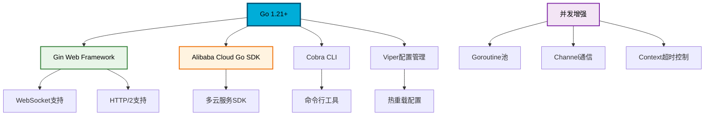
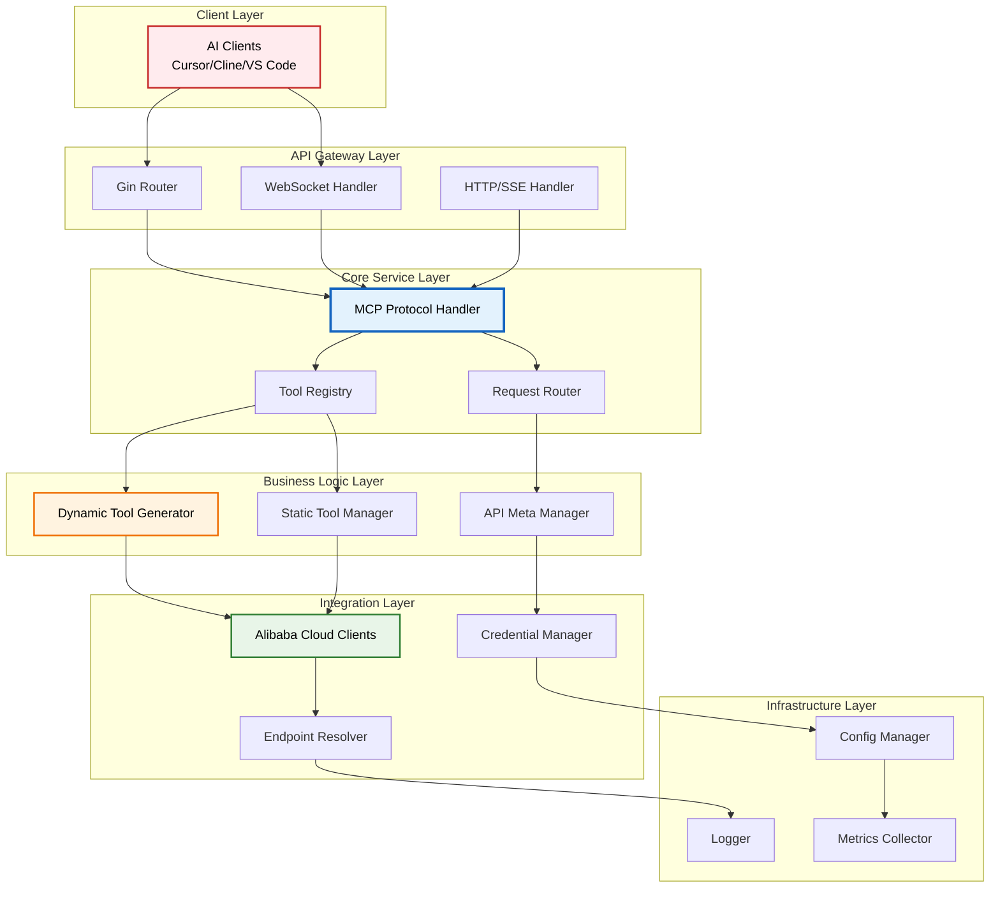
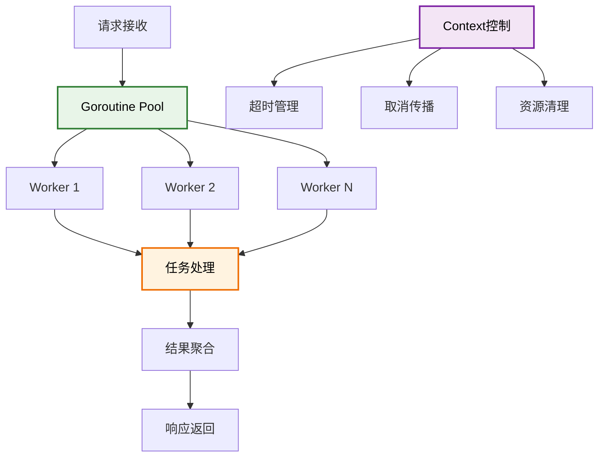
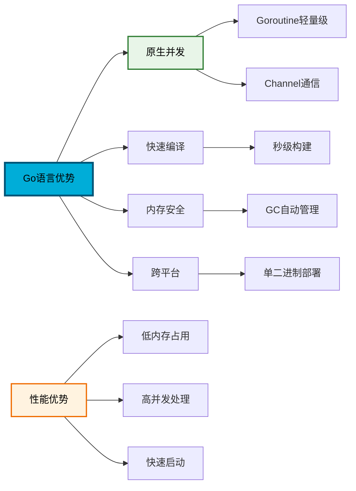
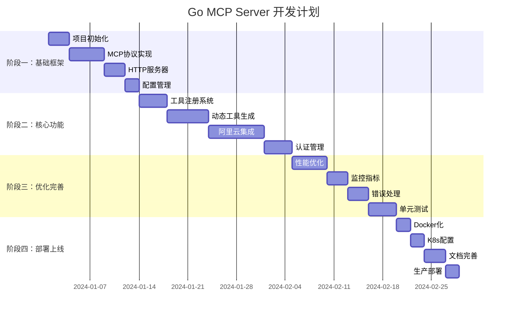

# **Go语言版 Alibaba Cloud Ops MCP Server 设计方案**

## **🎯 项目概览**

基于Go语言实现的高性能MCP (Model Context Protocol) 服务器，为AI助手提供阿里云资源管理能力。本方案充分利用Go语言的并发优势和类型安全特性，构建一个可扩展、高性能的云服务集成平台。

## **📋 技术栈选择**



### **核心依赖选型**

| **组件** | **Go包** | **版本** | **作用** |
|---------|---------|----------|----------|
| **Web框架** | `github.com/gin-gonic/gin` | `v1.9+` | **HTTP服务和WebSocket** |
| **CLI框架** | `github.com/spf13/cobra` | `v1.8+` | **命令行工具** |
| **配置管理** | `github.com/spf13/viper` | `v1.17+` | **配置文件和环境变量** |
| **JSON处理** | `github.com/bytedance/sonic` | `v1.10+` | **高性能JSON序列化** |
| **日志系统** | `github.com/sirupsen/logrus` | `v1.9+` | **结构化日志** |
| **并发控制** | `golang.org/x/sync/errgroup` | `latest` | **错误组和并发控制** |
| **阿里云SDK** | `github.com/alibabacloud-go/darabonba-openapi/v2` | `v2.0+` | **OpenAPI客户端** |

## **🏗️ 整体架构设计**

### **系统架构图**



## **📦 核心模块设计**

### **1. MCP协议处理模块**

```go
// pkg/mcp/protocol.go
package mcp

import (
    "context"
    "encoding/json"
    "fmt"
)

// MCPRequest MCP协议请求结构
type MCPRequest struct {
    ID     string                 `json:"id"`
    Method string                 `json:"method"`
    Params map[string]interface{} `json:"params,omitempty"`
}

// MCPResponse MCP协议响应结构
type MCPResponse struct {
    ID     string      `json:"id"`
    Result interface{} `json:"result,omitempty"`
    Error  *MCPError   `json:"error,omitempty"`
}

// MCPError 错误结构
type MCPError struct {
    Code    int    `json:"code"`
    Message string `json:"message"`
    Data    interface{} `json:"data,omitempty"`
}

// ProtocolHandler MCP协议处理器接口
type ProtocolHandler interface {
    HandleRequest(ctx context.Context, req *MCPRequest) (*MCPResponse, error)
    ListTools(ctx context.Context) ([]Tool, error)
    CallTool(ctx context.Context, name string, args map[string]interface{}) (interface{}, error)
}

// DefaultProtocolHandler 默认协议处理器
type DefaultProtocolHandler struct {
    toolRegistry ToolRegistry
    logger       Logger
}

func (h *DefaultProtocolHandler) HandleRequest(ctx context.Context, req *MCPRequest) (*MCPResponse, error) {
    switch req.Method {
    case "tools/list":
        tools, err := h.ListTools(ctx)
        if err != nil {
            return &MCPResponse{
                ID: req.ID,
                Error: &MCPError{Code: -32603, Message: err.Error()},
            }, nil
        }
        return &MCPResponse{ID: req.ID, Result: tools}, nil
        
    case "tools/call":
        name, ok := req.Params["name"].(string)
        if !ok {
            return &MCPResponse{
                ID: req.ID,
                Error: &MCPError{Code: -32602, Message: "Invalid tool name"},
            }, nil
        }
        
        args, _ := req.Params["arguments"].(map[string]interface{})
        result, err := h.CallTool(ctx, name, args)
        if err != nil {
            return &MCPResponse{
                ID: req.ID,
                Error: &MCPError{Code: -32603, Message: err.Error()},
            }, nil
        }
        return &MCPResponse{ID: req.ID, Result: result}, nil
        
    default:
        return &MCPResponse{
            ID: req.ID,
            Error: &MCPError{Code: -32601, Message: "Method not found"},
        }, nil
    }
}
```

### **2. 工具注册和管理模块**

```go
// pkg/tools/registry.go
package tools

import (
    "context"
    "reflect"
    "sync"
)

// Tool 工具定义接口
type Tool interface {
    Name() string
    Description() string
    Schema() *ToolSchema
    Execute(ctx context.Context, args map[string]interface{}) (interface{}, error)
}

// ToolSchema 工具参数模式
type ToolSchema struct {
    Type       string                 `json:"type"`
    Properties map[string]*Property   `json:"properties"`
    Required   []string               `json:"required"`
}

// Property 参数属性
type Property struct {
    Type        string      `json:"type"`
    Description string      `json:"description"`
    Default     interface{} `json:"default,omitempty"`
    Example     interface{} `json:"example,omitempty"`
}

// ToolRegistry 工具注册表接口
type ToolRegistry interface {
    Register(tool Tool) error
    Unregister(name string) error
    Get(name string) (Tool, bool)
    List() []Tool
    ExecuteTool(ctx context.Context, name string, args map[string]interface{}) (interface{}, error)
}

// DefaultToolRegistry 默认工具注册表
type DefaultToolRegistry struct {
    mu    sync.RWMutex
    tools map[string]Tool
}

func NewDefaultToolRegistry() *DefaultToolRegistry {
    return &DefaultToolRegistry{
        tools: make(map[string]Tool),
    }
}

func (r *DefaultToolRegistry) Register(tool Tool) error {
    r.mu.Lock()
    defer r.mu.Unlock()
    
    name := tool.Name()
    if _, exists := r.tools[name]; exists {
        return fmt.Errorf("tool %s already registered", name)
    }
    
    r.tools[name] = tool
    return nil
}

func (r *DefaultToolRegistry) ExecuteTool(ctx context.Context, name string, args map[string]interface{}) (interface{}, error) {
    r.mu.RLock()
    tool, exists := r.tools[name]
    r.mu.RUnlock()
    
    if !exists {
        return nil, fmt.Errorf("tool %s not found", name)
    }
    
    return tool.Execute(ctx, args)
}
```

### **3. 动态工具生成模块**

```go
// pkg/tools/dynamic.go
package tools

import (
    "context"
    "encoding/json"
    "fmt"
    "reflect"
    "strings"
)

// DynamicToolGenerator 动态工具生成器
type DynamicToolGenerator struct {
    apiMetaClient APIMetaClient
    clientFactory CloudClientFactory
}

// GenerateToolsForService 为服务生成工具
func (g *DynamicToolGenerator) GenerateToolsForService(service string, apis []string) ([]Tool, error) {
    var tools []Tool
    
    for _, apiName := range apis {
        tool, err := g.generateToolForAPI(service, apiName)
        if err != nil {
            return nil, fmt.Errorf("failed to generate tool for %s.%s: %w", service, apiName, err)
        }
        tools = append(tools, tool)
    }
    
    return tools, nil
}

func (g *DynamicToolGenerator) generateToolForAPI(service, api string) (Tool, error) {
    // 获取API元数据
    apiMeta, err := g.apiMetaClient.GetAPIMeta(service, api)
    if err != nil {
        return nil, err
    }
    
    // 构建工具模式
    schema, err := g.buildToolSchema(apiMeta)
    if err != nil {
        return nil, err
    }
    
    // 创建动态工具
    return &DynamicTool{
        name:          fmt.Sprintf("%s_%s", strings.ToUpper(service), api),
        description:   apiMeta.Summary,
        schema:        schema,
        service:       service,
        api:          api,
        clientFactory: g.clientFactory,
    }, nil
}

// DynamicTool 动态生成的工具
type DynamicTool struct {
    name          string
    description   string
    schema        *ToolSchema
    service       string
    api          string
    clientFactory CloudClientFactory
}

func (t *DynamicTool) Name() string { return t.name }
func (t *DynamicTool) Description() string { return t.description }
func (t *DynamicTool) Schema() *ToolSchema { return t.schema }

func (t *DynamicTool) Execute(ctx context.Context, args map[string]interface{}) (interface{}, error) {
    // 创建云服务客户端
    client, err := t.clientFactory.CreateClient(t.service, args)
    if err != nil {
        return nil, fmt.Errorf("failed to create client: %w", err)
    }
    
    // 调用API
    result, err := client.CallAPI(ctx, t.api, args)
    if err != nil {
        return nil, fmt.Errorf("API call failed: %w", err)
    }
    
    return result, nil
}
```

### **4. 阿里云客户端工厂模块**

```go
// pkg/cloud/factory.go
package cloud

import (
    "context"
    "fmt"
    "sync"
    
    openapi "github.com/alibabacloud-go/darabonba-openapi/v2/client"
    "github.com/alibabacloud-go/tea/tea"
)

// CloudClient 云服务客户端接口
type CloudClient interface {
    CallAPI(ctx context.Context, action string, params map[string]interface{}) (interface{}, error)
    GetEndpoint() string
    GetService() string
}

// CloudClientFactory 客户端工厂接口
type CloudClientFactory interface {
    CreateClient(service string, params map[string]interface{}) (CloudClient, error)
    GetSupportedServices() []string
}

// DefaultCloudClientFactory 默认客户端工厂
type DefaultCloudClientFactory struct {
    credentialManager CredentialManager
    endpointResolver  EndpointResolver
    clientCache       sync.Map
}

func NewDefaultCloudClientFactory(cm CredentialManager, er EndpointResolver) *DefaultCloudClientFactory {
    return &DefaultCloudClientFactory{
        credentialManager: cm,
        endpointResolver:  er,
    }
}

func (f *DefaultCloudClientFactory) CreateClient(service string, params map[string]interface{}) (CloudClient, error) {
    regionId, _ := params["RegionId"].(string)
    if regionId == "" {
        regionId = "cn-hangzhou"
    }
    
    cacheKey := fmt.Sprintf("%s:%s", service, regionId)
    
    // 检查缓存
    if cached, ok := f.clientCache.Load(cacheKey); ok {
        return cached.(CloudClient), nil
    }
    
    // 获取凭据
    cred, err := f.credentialManager.GetCredential()
    if err != nil {
        return nil, fmt.Errorf("failed to get credential: %w", err)
    }
    
    // 解析端点
    endpoint, err := f.endpointResolver.ResolveEndpoint(service, regionId)
    if err != nil {
        return nil, fmt.Errorf("failed to resolve endpoint: %w", err)
    }
    
    // 创建OpenAPI配置
    config := &openapi.Config{
        AccessKeyId:     tea.String(cred.AccessKeyId),
        AccessKeySecret: tea.String(cred.AccessKeySecret),
        SecurityToken:   tea.String(cred.SecurityToken),
        Endpoint:        tea.String(endpoint),
        RegionId:        tea.String(regionId),
        UserAgent:      tea.String("golang-mcp-server/1.0.0"),
    }
    
    // 创建客户端
    client := &DefaultCloudClient{
        config:  config,
        service: service,
        endpoint: endpoint,
    }
    
    // 缓存客户端
    f.clientCache.Store(cacheKey, client)
    
    return client, nil
}

// DefaultCloudClient 默认云客户端实现
type DefaultCloudClient struct {
    config   *openapi.Config
    service  string
    endpoint string
}

func (c *DefaultCloudClient) CallAPI(ctx context.Context, action string, params map[string]interface{}) (interface{}, error) {
    // 创建OpenAPI客户端
    client, err := openapi.NewClient(c.config)
    if err != nil {
        return nil, err
    }
    
    // 构建请求参数
    openApiRequest := &openapi.OpenApiRequest{
        Query: tea.StringMap(convertToStringMap(params)),
    }
    
    // 构建请求参数
    apiParams := &openapi.Params{
        Action:      tea.String(action),
        Version:     tea.String("2014-05-26"), // 需要动态获取
        Protocol:    tea.String("HTTPS"),
        Method:      tea.String("POST"),
        AuthType:    tea.String("AK"),
        Style:       tea.String("RPC"),
        Pathname:    tea.String("/"),
        ReqBodyType: tea.String("formData"),
        BodyType:    tea.String("json"),
    }
    
    // 调用API
    response, err := client.CallApiWithContext(ctx, apiParams, openApiRequest, &openapi.RuntimeOptions{})
    if err != nil {
        return nil, err
    }
    
    return response, nil
}

func convertToStringMap(params map[string]interface{}) map[string]*string {
    result := make(map[string]*string)
    for k, v := range params {
        if v != nil {
            if str, ok := v.(string); ok {
                result[k] = tea.String(str)
            } else {
                // 处理非字符串类型
                bytes, _ := json.Marshal(v)
                result[k] = tea.String(string(bytes))
            }
        }
    }
    return result
}
```

### **5. 配置管理模块**

```go
// pkg/config/config.go
package config

import (
    "fmt"
    "strings"
    
    "github.com/spf13/viper"
)

// Config 应用配置结构
type Config struct {
    Server    ServerConfig    `mapstructure:"server"`
    Cloud     CloudConfig     `mapstructure:"cloud"`
    Tools     ToolsConfig     `mapstructure:"tools"`
    Logging   LoggingConfig   `mapstructure:"logging"`
    Metrics   MetricsConfig   `mapstructure:"metrics"`
}

// ServerConfig 服务器配置
type ServerConfig struct {
    Host            string   `mapstructure:"host"`
    Port            int      `mapstructure:"port"`
    Mode            string   `mapstructure:"mode"` // stdio, http, websocket
    ReadTimeout     int      `mapstructure:"read_timeout"`
    WriteTimeout    int      `mapstructure:"write_timeout"`
    MaxConnections  int      `mapstructure:"max_connections"`
    EnableTLS       bool     `mapstructure:"enable_tls"`
    CertFile        string   `mapstructure:"cert_file"`
    KeyFile         string   `mapstructure:"key_file"`
}

// CloudConfig 云服务配置
type CloudConfig struct {
    Provider         string            `mapstructure:"provider"`
    Region           string            `mapstructure:"region"`
    Environment      string            `mapstructure:"environment"` // domestic, international
    Services         []string          `mapstructure:"services"`
    CredentialConfig CredentialConfig  `mapstructure:"credential"`
    EndpointConfig   EndpointConfig    `mapstructure:"endpoint"`
}

// CredentialConfig 凭据配置
type CredentialConfig struct {
    Type            string `mapstructure:"type"` // static, env, instance_role, sts
    AccessKeyId     string `mapstructure:"access_key_id"`
    AccessKeySecret string `mapstructure:"access_key_secret"`
    SecurityToken   string `mapstructure:"security_token"`
    RoleArn         string `mapstructure:"role_arn"`
    RoleSessionName string `mapstructure:"role_session_name"`
}

// ToolsConfig 工具配置
type ToolsConfig struct {
    EnabledServices map[string][]string `mapstructure:"enabled_services"`
    DynamicGenerate bool               `mapstructure:"dynamic_generate"`
    CacheTTL        int                `mapstructure:"cache_ttl"`
}

// LoadConfig 加载配置
func LoadConfig(configPath string) (*Config, error) {
    v := viper.New()
    
    // 设置配置文件
    if configPath != "" {
        v.SetConfigFile(configPath)
    } else {
        v.SetConfigName("config")
        v.SetConfigType("yaml")
        v.AddConfigPath("./configs")
        v.AddConfigPath(".")
    }
    
    // 环境变量配置
    v.SetEnvPrefix("GMCP")
    v.SetEnvKeyReplacer(strings.NewReplacer(".", "_"))
    v.AutomaticEnv()
    
    // 设置默认值
    setDefaults(v)
    
    // 读取配置文件
    if err := v.ReadInConfig(); err != nil {
        if _, ok := err.(viper.ConfigFileNotFoundError); !ok {
            return nil, fmt.Errorf("failed to read config file: %w", err)
        }
    }
    
    // 解析配置
    var config Config
    if err := v.Unmarshal(&config); err != nil {
        return nil, fmt.Errorf("failed to unmarshal config: %w", err)
    }
    
    return &config, nil
}

func setDefaults(v *viper.Viper) {
    // 服务器默认配置
    v.SetDefault("server.host", "127.0.0.1")
    v.SetDefault("server.port", 8080)
    v.SetDefault("server.mode", "stdio")
    v.SetDefault("server.read_timeout", 30)
    v.SetDefault("server.write_timeout", 30)
    v.SetDefault("server.max_connections", 1000)
    
    // 云服务默认配置
    v.SetDefault("cloud.provider", "alibaba")
    v.SetDefault("cloud.region", "cn-hangzhou")
    v.SetDefault("cloud.environment", "domestic")
    v.SetDefault("cloud.services", []string{"ecs", "vpc", "rds", "oss"})
    
    // 工具默认配置
    v.SetDefault("tools.dynamic_generate", true)
    v.SetDefault("tools.cache_ttl", 3600)
}
```

### **6. HTTP服务器模块**

```go
// pkg/server/http.go
package server

import (
    "context"
    "encoding/json"
    "net/http"
    "time"
    
    "github.com/gin-gonic/gin"
    "github.com/gorilla/websocket"
)

// HTTPServer HTTP服务器
type HTTPServer struct {
    config          *Config
    protocolHandler ProtocolHandler
    router          *gin.Engine
    upgrader        websocket.Upgrader
}

func NewHTTPServer(config *Config, handler ProtocolHandler) *HTTPServer {
    // 设置Gin模式
    if config.Server.Mode == "production" {
        gin.SetMode(gin.ReleaseMode)
    }
    
    server := &HTTPServer{
        config:          config,
        protocolHandler: handler,
        router:          gin.New(),
        upgrader: websocket.Upgrader{
            CheckOrigin: func(r *http.Request) bool {
                return true // 生产环境需要严格检查
            },
        },
    }
    
    server.setupRoutes()
    return server
}

func (s *HTTPServer) setupRoutes() {
    // 中间件
    s.router.Use(gin.Logger())
    s.router.Use(gin.Recovery())
    s.router.Use(s.corsMiddleware())
    
    // API路由
    api := s.router.Group("/api/v1")
    {
        api.POST("/mcp", s.handleMCPRequest)
        api.GET("/tools", s.handleListTools)
        api.POST("/tools/:name", s.handleCallTool)
    }
    
    // WebSocket路由
    s.router.GET("/ws", s.handleWebSocket)
    
    // SSE路由  
    s.router.GET("/sse", s.handleSSE)
    
    // 健康检查
    s.router.GET("/health", s.handleHealth)
}

func (s *HTTPServer) handleMCPRequest(c *gin.Context) {
    var req MCPRequest
    if err := c.ShouldBindJSON(&req); err != nil {
        c.JSON(http.StatusBadRequest, gin.H{"error": err.Error()})
        return
    }
    
    ctx, cancel := context.WithTimeout(c.Request.Context(), 30*time.Second)
    defer cancel()
    
    resp, err := s.protocolHandler.HandleRequest(ctx, &req)
    if err != nil {
        c.JSON(http.StatusInternalServerError, gin.H{"error": err.Error()})
        return
    }
    
    c.JSON(http.StatusOK, resp)
}

func (s *HTTPServer) handleWebSocket(c *gin.Context) {
    conn, err := s.upgrader.Upgrade(c.Writer, c.Request, nil)
    if err != nil {
        return
    }
    defer conn.Close()
    
    for {
        var req MCPRequest
        if err := conn.ReadJSON(&req); err != nil {
            break
        }
        
        ctx, cancel := context.WithTimeout(context.Background(), 30*time.Second)
        resp, err := s.protocolHandler.HandleRequest(ctx, &req)
        cancel()
        
        if err != nil {
            resp = &MCPResponse{
                ID: req.ID,
                Error: &MCPError{Code: -32603, Message: err.Error()},
            }
        }
        
        if err := conn.WriteJSON(resp); err != nil {
            break
        }
    }
}

func (s *HTTPServer) Start() error {
    addr := fmt.Sprintf("%s:%d", s.config.Server.Host, s.config.Server.Port)
    
    srv := &http.Server{
        Addr:         addr,
        Handler:      s.router,
        ReadTimeout:  time.Duration(s.config.Server.ReadTimeout) * time.Second,
        WriteTimeout: time.Duration(s.config.Server.WriteTimeout) * time.Second,
    }
    
    if s.config.Server.EnableTLS {
        return srv.ListenAndServeTLS(s.config.Server.CertFile, s.config.Server.KeyFile)
    }
    
    return srv.ListenAndServe()
}
```

## **⚡ 性能优化设计**

### **并发处理架构**



### **核心性能优化点**

```go
// pkg/performance/pool.go
package performance

import (
    "context"
    "runtime"
    "sync"
)

// WorkerPool Goroutine工作池
type WorkerPool struct {
    workerCount int
    taskQueue   chan Task
    wg          sync.WaitGroup
    ctx         context.Context
    cancel      context.CancelFunc
}

type Task struct {
    ID      string
    Handler func(ctx context.Context) (interface{}, error)
    Result  chan TaskResult
}

type TaskResult struct {
    Data  interface{}
    Error error
}

func NewWorkerPool(workerCount int) *WorkerPool {
    if workerCount <= 0 {
        workerCount = runtime.NumCPU()
    }
    
    ctx, cancel := context.WithCancel(context.Background())
    
    pool := &WorkerPool{
        workerCount: workerCount,
        taskQueue:   make(chan Task, workerCount*2),
        ctx:         ctx,
        cancel:      cancel,
    }
    
    pool.start()
    return pool
}

func (p *WorkerPool) start() {
    for i := 0; i < p.workerCount; i++ {
        p.wg.Add(1)
        go p.worker(i)
    }
}

func (p *WorkerPool) worker(id int) {
    defer p.wg.Done()
    
    for {
        select {
        case task := <-p.taskQueue:
            result := TaskResult{}
            result.Data, result.Error = task.Handler(p.ctx)
            
            select {
            case task.Result <- result:
            case <-p.ctx.Done():
                return
            }
            
        case <-p.ctx.Done():
            return
        }
    }
}

// 缓存管理器
type CacheManager struct {
    cache sync.Map
    ttl   time.Duration
}

type CacheItem struct {
    Data      interface{}
    ExpiresAt time.Time
}

func (c *CacheManager) Get(key string) (interface{}, bool) {
    if item, ok := c.cache.Load(key); ok {
        cacheItem := item.(*CacheItem)
        if time.Now().Before(cacheItem.ExpiresAt) {
            return cacheItem.Data, true
        }
        c.cache.Delete(key)
    }
    return nil, false
}

func (c *CacheManager) Set(key string, value interface{}) {
    item := &CacheItem{
        Data:      value,
        ExpiresAt: time.Now().Add(c.ttl),
    }
    c.cache.Store(key, item)
}
```

## **🔐 安全设计方案**

### **多层认证架构**

```go
// pkg/auth/manager.go
package auth

import (
    "context"
    "fmt"
    "os"
    "time"
)

// CredentialProvider 凭据提供者接口
type CredentialProvider interface {
    GetCredential(ctx context.Context) (*Credential, error)
    IsValid(ctx context.Context) bool
}

// Credential 凭据结构
type Credential struct {
    AccessKeyId     string
    AccessKeySecret string
    SecurityToken   string
    ExpiresAt       time.Time
}

// HeaderCredentialProvider 请求头凭据提供者
type HeaderCredentialProvider struct {
    accessKeyId     string
    accessKeySecret string
    securityToken   string
}

func NewHeaderCredentialProvider(headers map[string]string) *HeaderCredentialProvider {
    return &HeaderCredentialProvider{
        accessKeyId:     headers["X-Acs-AccessKey-Id"],
        accessKeySecret: headers["X-Acs-AccessKey-Secret"],
        securityToken:   headers["X-Acs-Security-Token"],
    }
}

func (p *HeaderCredentialProvider) GetCredential(ctx context.Context) (*Credential, error) {
    if p.accessKeyId == "" || p.accessKeySecret == "" {
        return nil, fmt.Errorf("missing access key credentials")
    }
    
    return &Credential{
        AccessKeyId:     p.accessKeyId,
        AccessKeySecret: p.accessKeySecret,
        SecurityToken:   p.securityToken,
        ExpiresAt:       time.Now().Add(24 * time.Hour),
    }, nil
}

// EnvCredentialProvider 环境变量凭据提供者
type EnvCredentialProvider struct{}

func (p *EnvCredentialProvider) GetCredential(ctx context.Context) (*Credential, error) {
    accessKeyId := os.Getenv("ALIBABA_CLOUD_ACCESS_KEY_ID")
    accessKeySecret := os.Getenv("ALIBABA_CLOUD_ACCESS_KEY_SECRET")
    securityToken := os.Getenv("ALIBABA_CLOUD_SECURITY_TOKEN")
    
    if accessKeyId == "" || accessKeySecret == "" {
        return nil, fmt.Errorf("missing environment credentials")
    }
    
    return &Credential{
        AccessKeyId:     accessKeyId,
        AccessKeySecret: accessKeySecret,
        SecurityToken:   securityToken,
        ExpiresAt:       time.Now().Add(24 * time.Hour),
    }, nil
}

// ChainCredentialProvider 凭据链提供者
type ChainCredentialProvider struct {
    providers []CredentialProvider
}

func NewChainCredentialProvider(providers ...CredentialProvider) *ChainCredentialProvider {
    return &ChainCredentialProvider{providers: providers}
}

func (p *ChainCredentialProvider) GetCredential(ctx context.Context) (*Credential, error) {
    for _, provider := range p.providers {
        if cred, err := provider.GetCredential(ctx); err == nil {
            return cred, nil
        }
    }
    return nil, fmt.Errorf("no valid credential found")
}
```

## **📊 项目结构**

```
golang-mcp-server/
├── cmd/
│   └── server/
│       └── main.go              # 程序入口
├── pkg/
│   ├── auth/                    # 认证模块
│   │   ├── manager.go
│   │   └── providers.go
│   ├── cloud/                   # 云服务集成
│   │   ├── factory.go
│   │   ├── client.go
│   │   └── endpoint.go
│   ├── config/                  # 配置管理
│   │   └── config.go
│   ├── mcp/                     # MCP协议
│   │   ├── protocol.go
│   │   └── types.go
│   ├── server/                  # HTTP服务器
│   │   ├── http.go
│   │   └── websocket.go
│   ├── tools/                   # 工具管理
│   │   ├── registry.go
│   │   ├── dynamic.go
│   │   └── static.go
│   └── performance/             # 性能优化
│       ├── pool.go
│       └── cache.go
├── configs/
│   ├── config.yaml              # 配置文件
│   └── config.example.yaml
├── internal/
│   ├── static/                  # 静态工具实现
│   │   ├── ecs_tools.go
│   │   ├── oss_tools.go
│   │   └── cms_tools.go
│   └── utils/                   # 工具函数
├── scripts/
│   ├── build.sh                 # 构建脚本
│   └── deploy.sh                # 部署脚本
├── docker/
│   └── Dockerfile
├── go.mod
├── go.sum
├── Makefile
└── README.md
```

## **🚀 部署方案**

### **Docker容器化部署**

```dockerfile
# docker/Dockerfile
FROM golang:1.21-alpine AS builder

WORKDIR /app
COPY go.mod go.sum ./
RUN go mod download

COPY . .
RUN CGO_ENABLED=0 GOOS=linux go build -a -installsuffix cgo -o main cmd/server/main.go

FROM alpine:latest
RUN apk --no-cache add ca-certificates
WORKDIR /root/

COPY --from=builder /app/main .
COPY --from=builder /app/configs ./configs

EXPOSE 8080
CMD ["./main"]
```

### **Kubernetes部署配置**

```yaml
# k8s/deployment.yaml
apiVersion: apps/v1
kind: Deployment
metadata:
  name: golang-mcp-server
spec:
  replicas: 3
  selector:
    matchLabels:
      app: golang-mcp-server
  template:
    metadata:
      labels:
        app: golang-mcp-server
    spec:
      containers:
      - name: golang-mcp-server
        image: golang-mcp-server:latest
        ports:
        - containerPort: 8080
        env:
        - name: GMCP_CLOUD_REGION
          value: "cn-hangzhou"
        - name: GMCP_SERVER_MODE
          value: "http"
        resources:
          limits:
            memory: "512Mi"
            cpu: "500m"
          requests:
            memory: "256Mi"
            cpu: "250m"
        livenessProbe:
          httpGet:
            path: /health
            port: 8080
          initialDelaySeconds: 30
          periodSeconds: 10
        readinessProbe:
          httpGet:
            path: /health
            port: 8080
          initialDelaySeconds: 5
          periodSeconds: 5
---
apiVersion: v1
kind: Service
metadata:
  name: golang-mcp-server-service
spec:
  selector:
    app: golang-mcp-server
  ports:
  - protocol: TCP
    port: 80
    targetPort: 8080
  type: LoadBalancer
```

## **📈 监控和可观测性**

### **Metrics收集**

```go
// pkg/metrics/collector.go
package metrics

import (
    "github.com/prometheus/client_golang/prometheus"
    "github.com/prometheus/client_golang/prometheus/promauto"
)

var (
    RequestsTotal = promauto.NewCounterVec(
        prometheus.CounterOpts{
            Name: "mcp_requests_total",
            Help: "The total number of MCP requests",
        },
        []string{"method", "status"},
    )
    
    RequestDuration = promauto.NewHistogramVec(
        prometheus.HistogramOpts{
            Name: "mcp_request_duration_seconds",
            Help: "The MCP request latencies in seconds",
        },
        []string{"method"},
    )
    
    ActiveConnections = promauto.NewGauge(
        prometheus.GaugeOpts{
            Name: "mcp_active_connections",
            Help: "The number of active connections",
        },
    )
    
    CloudAPICallsTotal = promauto.NewCounterVec(
        prometheus.CounterOpts{
            Name: "cloud_api_calls_total",
            Help: "The total number of cloud API calls",
        },
        []string{"service", "api", "status"},
    )
)
```

## **🔧 开发和构建**

### **Makefile**

```makefile
# Makefile
.PHONY: build test clean docker

# 构建配置
BINARY_NAME=golang-mcp-server
MAIN_PATH=./cmd/server
BUILD_DIR=./bin
VERSION=$(shell git describe --tags --always --dirty)
LDFLAGS=-ldflags "-X main.Version=${VERSION}"

# 默认目标
all: test build

# 构建
build:
	go build ${LDFLAGS} -o ${BUILD_DIR}/${BINARY_NAME} ${MAIN_PATH}

# 交叉编译
build-linux:
	CGO_ENABLED=0 GOOS=linux GOARCH=amd64 go build ${LDFLAGS} -o ${BUILD_DIR}/${BINARY_NAME}-linux ${MAIN_PATH}

build-windows:
	CGO_ENABLED=0 GOOS=windows GOARCH=amd64 go build ${LDFLAGS} -o ${BUILD_DIR}/${BINARY_NAME}-windows.exe ${MAIN_PATH}

build-darwin:
	CGO_ENABLED=0 GOOS=darwin GOARCH=amd64 go build ${LDFLAGS} -o ${BUILD_DIR}/${BINARY_NAME}-darwin ${MAIN_PATH}

# 测试
test:
	go test -v -cover ./...

test-race:
	go test -v -race ./...

# 代码检查
lint:
	golangci-lint run

# 清理
clean:
	go clean
	rm -rf ${BUILD_DIR}

# Docker构建
docker:
	docker build -t ${BINARY_NAME}:${VERSION} -f docker/Dockerfile .

# 安装依赖
deps:
	go mod download
	go mod verify

# 格式化代码
fmt:
	go fmt ./...

# 生成文档
docs:
	godoc -http=:6060

# 运行
run:
	go run ${MAIN_PATH}

# 开发模式运行
dev:
	go run ${MAIN_PATH} --config=./configs/config.example.yaml --server.mode=http

# 性能测试
benchmark:
	go test -bench=. -benchmem ./...
```

## **🎯 核心优势**

### **Go语言特有优势**



### **架构设计优势**

1. **高并发处理** - 利用Goroutine实现高效并发
2. **类型安全** - 编译时类型检查，运行时错误更少  
3. **内存效率** - GC自动管理，内存占用低
4. **部署简单** - 单二进制文件，无运行时依赖
5. **开发效率** - 简洁语法，快速编译，丰富标准库

### **与Python版本对比**

| **特性** | **Python版本** | **Go版本** | **优势** |
|---------|---------------|------------|----------|
| **性能** | 解释执行 | 编译执行 | **Go快3-5倍** |
| **并发** | GIL限制 | 原生支持 | **Go原生并发** |
| **内存** | 较高占用 | 低占用 | **Go节省50%+** |
| **部署** | 依赖复杂 | 单文件 | **Go部署简单** |
| **启动** | 较慢 | 极快 | **Go毫秒级启动** |
| **扩展** | 动态特性 | 接口设计 | **各有优势** |

## **🚧 实施计划**

### **开发阶段规划**



### **里程碑目标**

1. **Week 1-2**: 完成基础框架和MCP协议实现
2. **Week 3-4**: 实现核心工具管理和云服务集成
3. **Week 5-6**: 性能优化和监控体系
4. **Week 7-8**: 测试、部署和文档

## **📝 总结**

本设计方案充分利用Go语言的并发优势和类型安全特性，构建了一个高性能、可扩展的MCP服务器。相比Python版本，Go实现将在性能、并发处理和部署便利性方面具有显著优势，特别适合生产环境的高负载场景。

通过模块化设计、接口抽象和依赖注入，确保了系统的可扩展性和可维护性。完善的监控、日志和错误处理机制保障了系统的可靠性。配合Docker和Kubernetes的容器化部署方案，实现了云原生架构的标准实践。

---

*🚀 此设计方案提供了从架构设计到代码实现的完整解决方案，为Go语言版MCP Server的开发提供了详细的技术指导。*
